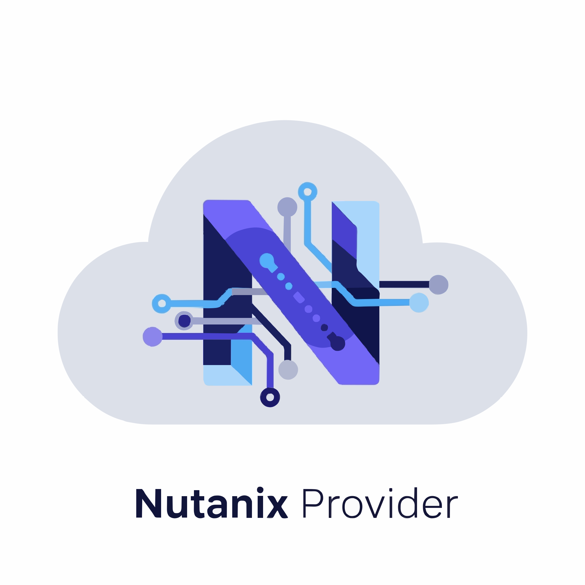
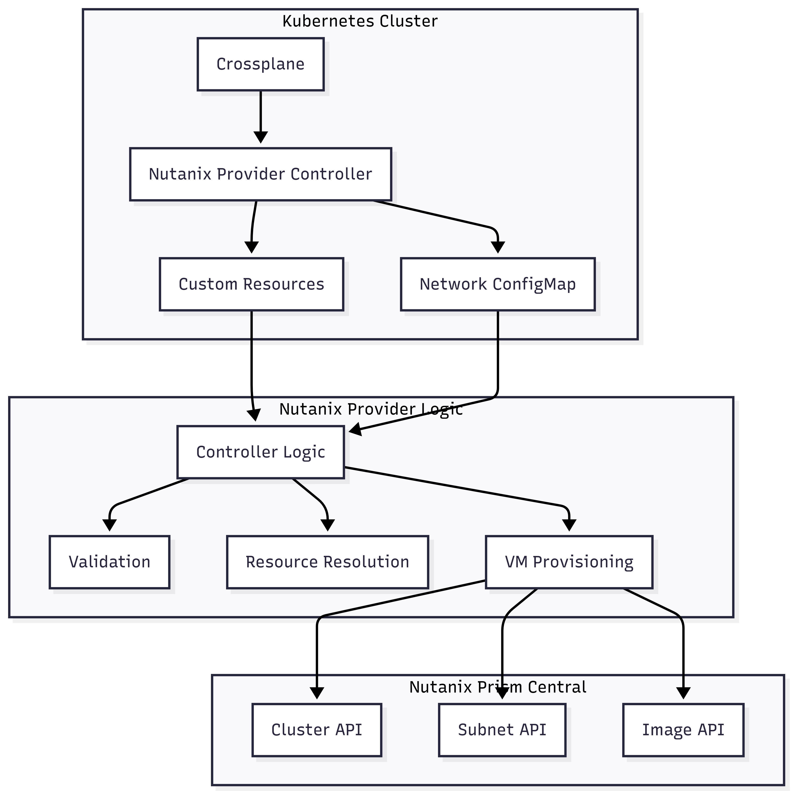

# Crossplane Nutanix Provider



A [Crossplane](https://crossplane.io/) provider for managing Nutanix resources. This provider enables you to provision and manage Nutanix virtual machines directly from Kubernetes using Crossplane's declarative approach.

## Features

- **Virtual Machine Management**: Create, update, and delete Nutanix VMs
- **Multi-Datacenter Support**: Configure different Prism Central endpoints for different datacenters
- **Dynamic Resource Resolution**: Automatically resolve cluster, subnet, and image UUIDs from names
- **Flexible Authentication**: Support for datacenter-specific credentials
- **Line of Business (LoB) Validation**: Optional validation of LoB fields for compliance
- **Additional Disks**: Support for attaching multiple disks to VMs
- **External Facts**: Attach custom metadata to VMs

## Quick Start

### 1. Install the Provider

**Option 1: Using kubectl (Recommended - Latest Stable)**

```bash
kubectl apply -f - <<EOF
apiVersion: pkg.crossplane.io/v1
kind: Provider
metadata:
  name: mgeorge67701-provider-nutanix
spec:
  package: ghcr.io/mgeorge67701/provider-nutanix:v0.3.0
  packagePullPolicy: Always
EOF
```

**Option 2: Using Crossplane CLI (GitHub Container Registry)**

```bash
kubectl crossplane install provider ghcr.io/mgeorge67701/provider-nutanix:v0.3.0
```

**Option 3: Using Upbound Marketplace**

```bash
kubectl crossplane install provider xpkg.upbound.io/mgeorge67701/provider-nutanix:v0.3.0
```

**Verify Installation**

```bash
# Check provider status
kubectl get providers.pkg.crossplane.io -n crossplane-system

# Check provider pod is running
kubectl get pods -n crossplane-system | grep nutanix

# Check CRDs are installed
kubectl get crd | grep nutanix
```

Expected output:
```
NAME                            INSTALLED   HEALTHY   PACKAGE
mgeorge67701-provider-nutanix   True        True      ghcr.io/mgeorge67701/provider-nutanix:v0.3.0

providerconfigs.nutanix.crossplane.io
virtualmachines.nutanix.crossplane.io
```

### 2. Create a ProviderConfig

Create a secret with your Nutanix credentials for each prism central endpoint.

```bash
kubectl create secret generic nutanix-creds-alpha \
  --from-literal=credentials='{"username":"admin-alpha","password":"alpha-password"}' \
  -n crossplane-system

kubectl create secret generic nutanix-creds-beta \
  --from-literal=credentials='{"username":"admin-beta","password":"beta-password"}' \
  -n crossplane-system
```

or

```yaml
apiVersion: v1
kind: Secret
metadata:
  name: nutanix-creds-alpha
  namespace: crossplane-system
type: Opaque
stringData:
  credentials: '{"username":"admin-alpha","password":"alpha-password"}'

apiVersion: v1
kind: Secret
metadata:
  name: nutanix-creds-beta
  namespace: crossplane-system
 type: Opaque
 stringData:
   credentials: '{"username":"admin-beta","password":"beta-password"}'
```

Apply the ProviderConfig:

```yaml
apiVersion: nutanix.crossplane.io/v1beta1
kind: ProviderConfig
metadata:
  name: default
spec:
  credentials:
    source: Secret
    secretRef:
      namespace: crossplane-system
      name: nutanix-creds-default
      key: credentials
  prismCentralEndpoints:
    dc-alpha: "https://pc-alpha.example.com:9440"
    dc-beta: "https://pc-beta.example.com:9440"
  # Define datacenter-specific credentials
  datacenterCredentials:
    dc-alpha:
      source: Secret
      secretRef:
        namespace: crossplane-system
        name: nutanix-creds-alpha
        key: credentials
    dc-beta:
      source: Secret
      secretRef:
        namespace: crossplane-system
        name: nutanix-creds-beta
        key: credentials
```

### 3. Create a Virtual Machine

```yaml
apiVersion: nutanix.crossplane.io/v1alpha1
kind: VirtualMachine
metadata:
  name: my-vm
spec:
  name: "my-crossplane-vm"
  numVcpus: 2
  memorySizeMib: 4096
  clusterName: "my-cluster"
  datacenter: "dc-alpha"
  imageName: "ubuntu-22.04-cloud"
  network: "network-details" # References the ConfigMap named 'network-details'
  providerConfigRef:
    name: default
```

## Examples

The `examples/` directory contains comprehensive examples.

### Basic Virtual Machine

**File**: `examples/virtualmachine.yaml`
**Description**: Simple VM with basic configuration.

```yaml
apiVersion: nutanix.crossplane.io/v1alpha1
kind: VirtualMachine
metadata:
  name: example-vm
spec:
  name: "my-crossplane-vm"
  numVcpus: 2
  memorySizeMib: 4096
  clusterName: "aza-ntnx-01"  # Specify the cluster name to fetch details dynamically
  datacenter: "dc-alpha" # Specify the datacenter for Prism Central endpoint selection
  imageName: "ubuntu-22.04-cloud" # Can be a full or partial image name (e.g., "rhel8", "win2022"). The provider will dynamically resolve the image UUID from Nutanix Prism Central, selecting the latest matching image if a partial name is provided.
  network: "network-details" # The provider will fetch network details from the ConfigMap named 'network-details'.
  lob: "CLOUD" # Must be one of the allowedLobs in ProviderConfig if mandatory
  providerConfigRef:
    name: all-features-config
```

### Advanced Virtual Machine

**File**: `examples/virtualmachine-advanced.yaml`
**Description**: VM with additional disks and external facts.

```yaml
apiVersion: nutanix.crossplane.io/v1alpha1
kind: VirtualMachine
metadata:
  name: example-vm-advanced
spec:
  name: "my-advanced-crossplane-vm"
  numVcpus: 4
  memorySizeMib: 8192
  clusterName: "aza-ntnx-01"
  datacenter: "dc-beta" # Specify the datacenter for Prism Central endpoint selection
  imageName: "rhel8" # Example: partial image name, provider selects latest RHEL 8
  network: "network-details"
  lob: "SECURITY" # Example: another valid LoB from ProviderConfig
  additionalDisks:
    - deviceIndex: 1
      sizeGb: 50
      imageName: "data-disk-template" # Optional: use an image for the disk
    - deviceIndex: 2
      sizeGb: 100
  externalFacts:
    environment: "production"
    application: "webserver"
    owner: "devops-team"
  providerConfigRef:
    name: all-features-config
```

### Full ProviderConfig

**File**: `examples/providerconfig-all-features.yaml`
**Description**: Complete ProviderConfig showing all available features.

```yaml
apiVersion: nutanix.crossplane.io/v1beta1
kind: ProviderConfig
metadata:
  name: all-features-config
spec:
  # Default credentials for the provider. These are used if no datacenter-specific
  # credentials are provided or if no datacenter is specified in the VM spec.
  credentials:
    source: Secret
    secretRef:
      namespace: crossplane-system
      name: nutanix-creds-default
      key: credentials

  # Configure LoB (Line of Business) validation for VirtualMachines.
  # If 'isLobMandatory' is true, the 'lob' field in VirtualMachine spec is required.
  # If 'lob' is provided, its value must be one of the 'allowedLobs'.
  allowedLobs:
    - CLOUD
    - SECURITY
    - DEV
    - PROD
  isLobMandatory: true # Set to false if LoB field should be optional

  # Define Prism Central endpoints for different datacenters.
  # The provider will use the 'datacenter' field in the VirtualMachine spec
  # to select the appropriate endpoint from this map.
  prismCentralEndpoints:
    dc-alpha: "https://pc-alpha.example.com:9440"
    dc-beta: "https://pc-beta.example.com:9440"
    dc-gamma: "https://pc-gamma.example.com:9440"

  # Define datacenter-specific credentials.
  # These credentials will override the default 'credentials' for the specified datacenter.
  # If a datacenter is specified in the VM, the provider will first look for
  # credentials here. If not found, it falls back to the default credentials.
  datacenterCredentials:
    dc-alpha:
      source: Secret
      secretRef:
        namespace: crossplane-system
        name: nutanix-creds-alpha
        key: credentials
    dc-beta:
      source: Secret
      secretRef:
        namespace: crossplane-system
        name: nutanix-creds-beta
        key: credentials
```

### Network Details ConfigMap

**File**: `examples/network-details-configmap.yaml`
**Description**: Example ConfigMap for network configuration data.

```yaml
apiVersion: v1
kind: ConfigMap
metadata:
  name: network-details
  namespace: crossplane-system
data:
  network-details.json: |
    {
      "domain": "example.com",
      "nameserver": "192.168.1.1",
      "gateway": "192.168.1.254",
      "network": "192.168.1.0/24",
      "subnet": "example-subnet",
      "email": "admin@example.com",
      "puppet_master": "puppet.example.com",
      "network_management_server": "nms.example.com",
      "foreman_host": "foreman.example.com",
      "allowed_repos": [
        "test1",
        "test2"
      ]
    }
```

## Configuration

### ProviderConfig Options

| Field | Description | Required |
|-------|-------------|----------|
| `credentials` | Default authentication credentials | Yes |
| `allowedLobs` | List of allowed Line of Business values | No |
| `isLobMandatory` | Whether LoB field is required for VMs | No |
| `prismCentralEndpoints` | Map of datacenter names to PC endpoints | No |
| `datacenterCredentials` | Datacenter-specific credentials | No |
| `enableAvailabilityZoneMapping` | Enable AZ to cluster mapping | No |
| `availabilityZoneMappingURL` | URL for AZ mapping CSV | No |

### VirtualMachine Spec Options

| Field | Description | Required |
|-------|-------------|----------|
| `name` | VM name in Nutanix | Yes |
| `numVcpus` | Number of vCPUs | Yes |
| `memorySizeMib` | Memory size in MiB | Yes |
| `clusterName` or `clusterUuid` | Target cluster | Yes (one of) |
| `subnetName` or `subnetUuid` | Network subnet | No |
| `imageName` or `imageUuid` | Base image | No |
| `datacenter` | Datacenter for PC selection | No |
| `lob` | Line of Business | No |
| `additionalDisks` | Extra disks to attach | No |
| `externalFacts` | Custom metadata | No |
| `providerConfigRef` | Reference to ProviderConfig | No |

## Resource Resolution

The provider can dynamically resolve UUIDs from names:

- **Clusters**: Specify `clusterName` instead of `clusterUuid`
- **Subnets**: Specify `subnetName` instead of `subnetUuid`
- **Images**: Specify `imageName` instead of `imageUuid` (supports partial names)

When using names, the provider will query the appropriate Prism Central to find matching resources.

## Multi-Datacenter Support

Configure multiple Prism Central endpoints:

```yaml
spec:
  prismCentralEndpoints:
    dc-alpha: "https://pc-alpha.example.com:9440"
    dc-beta: "https://pc-beta.example.com:9440"
  datacenterCredentials:
    dc-beta:
      source: Secret
      secretRef:
        name: nutanix-creds-beta
        key: credentials
```

VMs can specify which datacenter to use:

```yaml
spec:
  datacenter: "dc-beta"  # Uses pc-beta.example.com and specific credentials
```

## Architecture Diagram

Below is the architecture of the Crossplane Nutanix Provider:



This diagram shows how Crossplane, your custom Nutanix provider controller, and Kubernetes resources interact to provision Nutanix VMs. The controller reads custom resources and network details, validates and resolves them, and provisions VMs via Nutanix Prism Central APIs.

---

## Development

### Prerequisites

- Go 1.21+
- Docker
- kubectl
- Crossplane CLI (`kubectl crossplane`)

### Building

**Using Make (Recommended)**

```bash
# Show all available commands
make help

# Build and test
make test
make docker-build
make xpkg-build

# Complete release (build multi-platform image and package)
make release VERSION=v1.0.0

# Install provider in current cluster
make install VERSION=v1.0.0

# Check provider status
make status
```

**Manual Building**

**Single Architecture (local development):**

```bash
# Build the Docker image
docker build -t ghcr.io/mgeorge67701/provider-nutanix:latest .

# Build the Crossplane package (xpkg)
up xpkg build --package-root=package --controller=ghcr.io/mgeorge67701/provider-nutanix:latest -o provider-nutanix-latest.xpkg

# Push both the container image and package
docker push ghcr.io/mgeorge67701/provider-nutanix:latest
up xpkg push ghcr.io/mgeorge67701/provider-nutanix:latest -f provider-nutanix-latest.xpkg
```

**Multi-Architecture Build (Production - Latest: v0.3.0)**

**✅ CONFIRMED WORKING**: Both GHCR and Upbound registries work with this approach

**Note**: Upbound doesn't support multi-architecture builds. Build the image for **amd64** or **arm64** on Linux or Mac, or use **GHCR**.

```bash
echo $GITHUB_TOKEN | docker login ghcr.io -u mgeorge67701 --password-stdin
up login
# Set your version
export VERSION=v0.3.0

# Step 1: Build and push multi-architecture controller image (with -controller suffix)
make docker-buildx VERSION=${VERSION}
# This runs: docker buildx build --platform linux/amd64,linux/arm64 -t ghcr.io/mgeorge67701/provider-nutanix:v0.3.0-controller --push .

# Pull the image
docker pull ghcr.io/mgeorge67701/provider-nutanix:v0.1.0-controller 2>&1

# Step 2: Build Crossplane package using the controller image
make xpkg-build VERSION=${VERSION}
# This runs: up xpkg build --package-root=package --controller=ghcr.io/mgeorge67701/provider-nutanix:v0.3.0-controller -o provider-nutanix-v0.3.0.xpkg

# Step 3: Push to GHCR (GitHub Container Registry)
make xpkg-push VERSION=${VERSION}
# This runs: up xpkg push ghcr.io/mgeorge67701/provider-nutanix:v0.3.0 -f provider-nutanix-v0.3.0.xpkg

# OR Step 3: Push to Upbound Registry (alternative)
up xpkg push xpkg.upbound.io/mgeorge67701/provider-nutanix:${VERSION} -f provider-nutanix-${VERSION}.xpkg

# Step 4: Create a GitHub release
# First, create and push a git tag
git tag ${VERSION}
git push origin ${VERSION}

# Set your GitHub token (create one at https://github.com/settings/tokens)
# with 'repo' scope for private repos or 'public_repo' for public repos
export GITHUB_TOKEN=your_token_here

# Create the release using GitHub API
curl -X POST -H "Authorization: Bearer $GITHUB_TOKEN" \
  -H "Accept: application/vnd.github.v3+json" \
  -H "Content-Type: application/json" \
  "https://api.github.com/repos/mgeorge67701/crossplane-nutanix/releases" \
  -d "{
    \"tag_name\": \"${VERSION}\",
    \"name\": \"${VERSION}\",
    \"body\": \"Release ${VERSION} of provider-nutanix\\n\\n## What's Changed\\n- Provider package built and published to ghcr.io/mgeorge67701/provider-nutanix:${VERSION}-controller\\n- Package also available on Upbound registry: xpkg.upbound.io/mgeorge67701/provider-nutanix:${VERSION}\",
    \"draft\": false,
    \"prerelease\": false,
    \"generate_release_notes\": true
  }"
```

**Manual Multi-Architecture Commands (without Make):**

```bash
# Set version
export VERSION=v0.3.0

# Step 1: Setup Docker Buildx (one-time setup)
docker buildx create --name multiarch --driver docker-container --bootstrap --use

# Step 2: Build and push multi-architecture controller image
docker buildx build \
  --platform linux/amd64,linux/arm64 \
  --tag ghcr.io/mgeorge67701/provider-nutanix:${VERSION}-controller \
  --push \
  .

# Step 3: Build Crossplane package using controller image
up xpkg build \
  --package-root=package \
  --controller=ghcr.io/mgeorge67701/provider-nutanix:${VERSION}-controller \
  -o provider-nutanix-${VERSION}.xpkg

# Step 4: Push Crossplane package to GHCR
up xpkg push ghcr.io/mgeorge67701/provider-nutanix:${VERSION} -f provider-nutanix-${VERSION}.xpkg

# Optional: Push to Upbound Registry
up xpkg push xpkg.upbound.io/mgeorge67701/provider-nutanix:${VERSION} -f provider-nutanix-${VERSION}.xpkg

# Step 5: Create GitHub Release
git tag ${VERSION}
git push origin ${VERSION}

# Set your GitHub token (if not already set)
export GITHUB_TOKEN=your_token_here

# Create the release with release notes
curl -X POST -H "Authorization: Bearer $GITHUB_TOKEN" \
  -H "Accept: application/vnd.github.v3+json" \
  -H "Content-Type: application/json" \
  "https://api.github.com/repos/mgeorge67701/crossplane-nutanix/releases" \
  -d "{
    \"tag_name\": \"${VERSION}\",
    \"name\": \"${VERSION}\",
    \"body\": \"Release ${VERSION} of provider-nutanix\\n\\n## What's Changed\\n- Provider package built and published to ghcr.io/mgeorge67701/provider-nutanix:${VERSION}-controller\\n- Package also available on Upbound registry: xpkg.upbound.io/mgeorge67701/provider-nutanix:${VERSION}\",
    \"draft\": false,
    \"prerelease\": false,
    \"generate_release_notes\": true
  }"
```

**Verify Multi-Architecture Build:**

```bash
# Check controller image has both architectures
docker buildx imagetools inspect ghcr.io/mgeorge67701/provider-nutanix:v0.3.0-controller

# Test deployment from GHCR (recommended)
kubectl patch provider.pkg.crossplane.io mgeorge67701-provider-nutanix --type='merge' -p='{"spec":{"package":"ghcr.io/mgeorge67701/provider-nutanix:v0.3.0"}}'
kubectl get provider.pkg.crossplane.io mgeorge67701-provider-nutanix

# Test deployment from Upbound Registry (alternative)
kubectl patch provider.pkg.crossplane.io mgeorge67701-provider-nutanix --type='merge' -p='{"spec":{"package":"xpkg.upbound.io/mgeorge67701/provider-nutanix:v0.3.0"}}'
kubectl get provider.pkg.crossplane.io mgeorge67701-provider-nutanix
```

**Test Results (Confirmed Working - Latest Release):**
- ✅ **GHCR v0.3.0**: `ghcr.io/mgeorge67701/provider-nutanix:v0.3.0` → INSTALLED: True, HEALTHY: True
- ✅ **Upbound v0.3.0**: `xpkg.upbound.io/mgeorge67701/provider-nutanix:v0.3.0` → INSTALLED: True, HEALTHY: True
- ✅ **Multi-arch**: Both linux/amd64 and linux/arm64 platforms supported
- ✅ **Pod Status**: Running successfully with proper entrypoint
- ✅ **GitHub Release**: Available at [v0.3.0](https://github.com/mgeorge67701/crossplane-nutanix/releases/tag/v0.3.0)

### Testing

```bash
# Run unit tests
go test ./...

# Run controller locally (requires Kubernetes cluster and KUBECONFIG)
go run cmd/provider/main.go --debug
```

### Releasing

This project uses automated versioning and releases via GitHub Actions:

1. **Create a git tag**: The CI pipeline will detect the tag and build/publish automatically
   ```bash
   git tag v1.0.0
   git push origin v1.0.0
   ```

2. **Manual Release**: For manual releases, follow these steps:
   ```bash
   # Build and push Docker image
   docker buildx build --platform linux/amd64,linux/arm64 -t ghcr.io/mgeorge67701/provider-nutanix:v1.0.0-controller --push .
   
   # Build and push Crossplane package
   up xpkg build --package-root=package --controller=ghcr.io/mgeorge67701/provider-nutanix:v1.0.0-controller -o provider-nutanix-v1.0.0.xpkg
   up xpkg push ghcr.io/mgeorge67701/provider-nutanix:v1.0.0 -f provider-nutanix-v1.0.0.xpkg
   
   # Create GitHub Release (set GITHUB_TOKEN environment variable first)
   curl -X POST -H "Authorization: Bearer $GITHUB_TOKEN" \
     -H "Accept: application/vnd.github.v3+json" \
     -H "Content-Type: application/json" \
     "https://api.github.com/repos/mgeorge67701/crossplane-nutanix/releases" \
     -d "{
       \"tag_name\": \"v1.0.0\",
       \"name\": \"v1.0.0\",
       \"body\": \"Release v1.0.0 of provider-nutanix\\n\\n## What's Changed\\n- Provider package built and published to ghcr.io/mgeorge67701/provider-nutanix:v1.0.0-controller\\n- Package also available on Upbound registry: xpkg.upbound.io/mgeorge67701/provider-nutanix:v1.0.0\",
       \"draft\": false,
       \"prerelease\": false,
       \"generate_release_notes\": true
     }"
   ```

3. **Available Versions**: Check [GitHub Releases](https://github.com/mgeorge67701/crossplane-nutanix/releases) for all available versions

### Publishing to Upbound Marketplace

To publish your provider to the Upbound Marketplace (like provider-kubernetes):

1. **Set up Upbound credentials** in GitHub Secrets:
   - `UPBOUND_ACCESS_ID`: Your Upbound access ID
   - `UPBOUND_TOKEN`: Your Upbound token

2. **Create a release** - the CI/CD will automatically publish to both:
   - GitHub Container Registry: `ghcr.io/mgeorge67701/provider-nutanix:VERSION`
   - Upbound Registry: `xpkg.upbound.io/mgeorge67701/provider-nutanix:VERSION`

3. **Your provider will appear** in the Upbound Marketplace at:
   `https://marketplace.upbound.io/providers/mgeorge67701/provider-nutanix`

**Manual publish to Upbound**:
```bash
# Login to Upbound
up login

# Build and push package
up xpkg build --package-root=package --controller=ghcr.io/mgeorge67701/provider-nutanix:v1.0.0 -o provider.xpkg
up xpkg push xpkg.upbound.io/mgeorge67701/provider-nutanix:v1.0.0 -f provider.xpkg
```

## Troubleshooting

### Provider Pod Shows "CreateContainerError: no command specified"

This error occurs when the Crossplane package (xpkg) is built incorrectly. The issue is usually:

1. **Hardcoded controller image in crossplane.yaml**: The `spec.controller.image` field should NOT be present in `package/crossplane.yaml`
2. **Incorrect xpkg build**: Use `up xpkg build --controller=<image>` to properly reference the controller image
3. **Broken Docker image**: Ensure your Dockerfile has proper `ENTRYPOINT` and `CMD` instructions
4. **Pipeline overwrites controller image**: In CI/CD, the xpkg build can overwrite the controller image if not done properly

**Solution (Multi-Architecture - Recommended)**:
```bash
# Use the multi-architecture build process (see Manual Building section above)
export VERSION=v0.3.0
make docker-buildx VERSION=${VERSION}  # Multi-arch controller image
make xpkg-build VERSION=${VERSION}     # Package with proper controller reference
make xpkg-push VERSION=${VERSION}      # Push package
```

**Solution (Single Architecture)**:
```bash
# 1. Remove spec.controller.image from package/crossplane.yaml
# 2. Build Docker image first
docker build -t ghcr.io/mgeorge67701/provider-nutanix:v1.0.0 .

# 3. Build xpkg with --controller flag
up xpkg build --package-root=package --controller=ghcr.io/mgeorge67701/provider-nutanix:v1.0.0 -o provider.xpkg

# 4. Push both
docker push ghcr.io/mgeorge67701/provider-nutanix:v1.0.0
up xpkg push ghcr.io/mgeorge67701/provider-nutanix:v1.0.0 -f provider.xpkg
```

### Provider Shows as Unhealthy

Check the provider revision status:
```bash
kubectl get providerrevisions.pkg.crossplane.io -o wide
kubectl describe providerrevision <revision-name>
```

### CRDs Not Installing

Ensure your CRD files are in the correct location and referenced properly in `package/crossplane.yaml`.

## Contributing

1. Fork the repository
2. Create a feature branch
3. Make your changes
4. Add tests for new functionality
5. Run `make test` and `make lint`
6. Submit a pull request

## License

This project is licensed under the Apache License 2.0 - see the [LICENSE](LICENSE) file for details.

## Support

- **Issues**: [GitHub Issues](https://github.com/mgeorge67701/crossplane-nutanix/issues)
- **Discussions**: [GitHub Discussions](https://github.com/mgeorge67701/crossplane-nutanix/discussions)
- **Crossplane Community**: [Crossplane Slack](https://slack.crossplane.io/)
# Multi-arch build test
