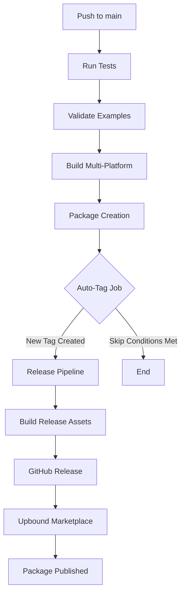

# Automatic Release Pipeline

This document explains how the automatic versioning and release pipeline works for the Crossplane Nutanix Provider.

## Overview

The CI/CD pipeline now includes automatic tag creation and release publishing to streamline the development workflow. When changes are pushed to the `main` branch, the pipeline can automatically:

1. **Run Tests & Package Build** - Validates code and creates packages
2. **Auto-Create Version Tags** - Generates semantic version tags based on commits
3. **Trigger Release Pipeline** - Publishes to GitHub Releases and Upbound Marketplace

## How Auto-Versioning Works

### Automatic Tag Creation

When you push changes to the `main` branch:

1. **Package Build** completes successfully
2. **Auto-Tag Job** analyzes your commits and determines version bump:
   - **Major** (v1.0.0 → v2.0.0): Commits containing `BREAKING`, `breaking change`, or `major:`
   - **Minor** (v1.0.0 → v1.1.0): Commits containing `feat:`, `feature:`, or `minor:`
   - **Patch** (v1.0.0 → v1.0.1): All other commits (default)
3. **New Tag** is created and pushed automatically
4. **Release Pipeline** triggers immediately to publish the new version

### Smart Skip Logic

The auto-tag job includes intelligence to avoid unnecessary releases:

- Skips if the last commit was auto-generated (prevents loops)
- Skips if there are no commits since the last tag
- Only creates tags after successful package builds

## Manual Version Control

You can also manually control versioning:

### Using Make Commands

```bash
# Preview the next version (no changes)
make version-dry-run

# Create patch version (v1.0.1 → v1.0.2)
make version-patch

# Create minor version (v1.0.1 → v1.1.0)  
make version-minor

# Create major version (v1.0.1 → v2.0.0)
make version-major
```

### Using the Script Directly

```bash
# Preview next patch version
./scripts/version.sh patch --dry-run

# Create and tag a new minor version
./scripts/version.sh minor

# Create and tag a new major version  
./scripts/version.sh major
```

### Manual Tag Creation

```bash
# Create a tag manually
git tag -a v1.0.47 -m "Manual release v1.0.47"
git push origin v1.0.47
```

## Commit Message Conventions

To take advantage of smart version bumping, use these commit message prefixes:

### Patch Releases (Bug Fixes)
```
fix: resolve authentication timeout issue
docs: update installation instructions
chore: update dependencies
```

### Minor Releases (New Features)
```
feat: add support for custom disk configurations
feature: implement multi-datacenter support
minor: enhance VM configuration options
```

### Major Releases (Breaking Changes)
```
BREAKING: change API structure for provider config
breaking change: remove deprecated VM parameters
major: restructure configuration schema
```

## CI/CD Pipeline Flow



## Workflow Examples

### Typical Development Flow
1. Make changes and commit with descriptive messages
2. Push to `main` branch: `git push origin main`
3. CI automatically runs tests and builds packages
4. If successful, auto-tag creates new version (e.g., v1.0.47)
5. Release pipeline publishes to Upbound Marketplace
6. Package is available at `xpkg.upbound.io/mgeorge67701/provider-nutanix:v1.0.47`

### Emergency Manual Release
1. Make critical fixes
2. Manually create tag: `make version-patch`  
3. Push tag: `git push --tags`
4. Release pipeline triggers immediately

### Feature Release
1. Develop new features with `feat:` prefixed commits
2. Push to `main`: `git push origin main`
3. Auto-tag detects features and bumps minor version
4. Automatic release includes all new features

## Monitoring Releases

- **GitHub Actions**: Monitor pipeline at https://github.com/mgeorge67701/crossplane-nutanix/actions
- **GitHub Releases**: View releases at https://github.com/mgeorge67701/crossplane-nutanix/releases  
- **Upbound Marketplace**: Check published packages at https://marketplace.upbound.io/providers/mgeorge67701/provider-nutanix

## Troubleshooting

### Auto-Tag Not Created
- Check if commit messages match skip conditions
- Verify package job completed successfully
- Review auto-tag job logs for skip reasons

### Release Pipeline Failed
- Check Upbound credentials in repository secrets
- Verify package format in publish-to-upbound job
- Review logs for specific error messages

### Manual Recovery
If automatic process fails, you can always manually:
```bash
# Create tag manually
git tag -a v1.0.48 -m "Manual recovery release"
git push origin v1.0.48

# Or use the version script
./scripts/version.sh patch
git push --tags
```

This setup provides a robust, automated release pipeline while maintaining full manual control when needed.
